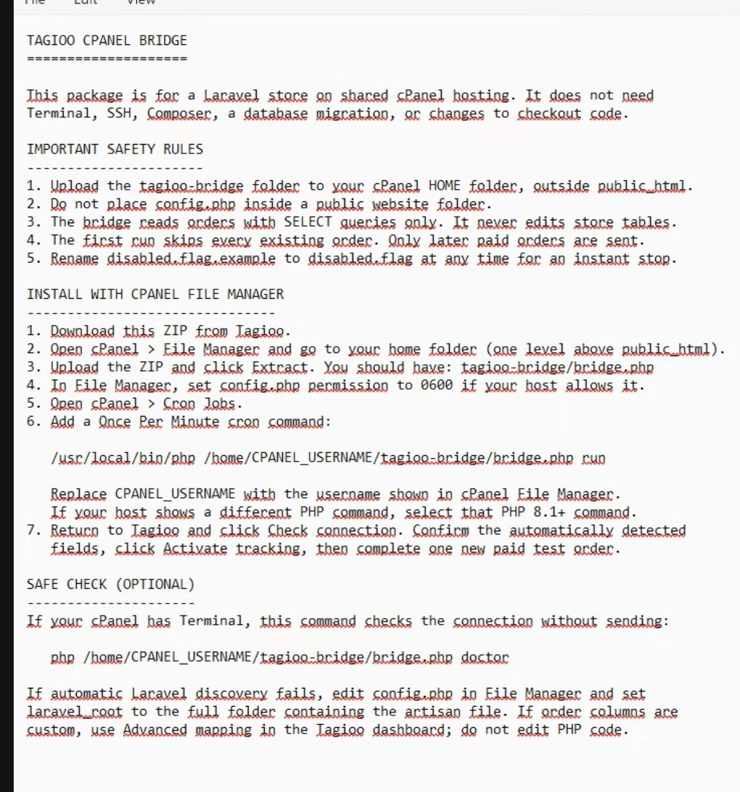
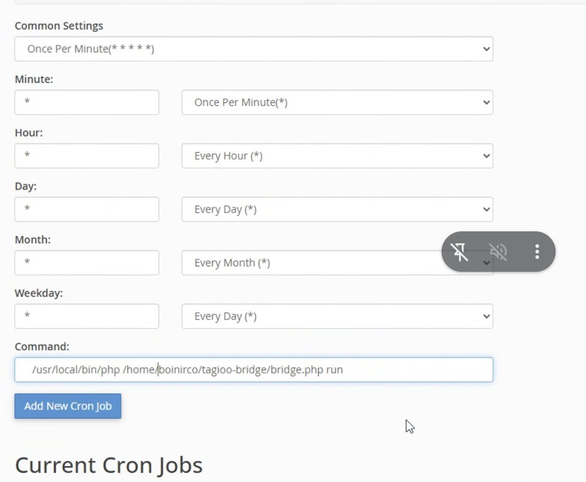
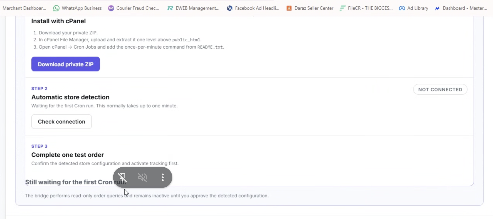
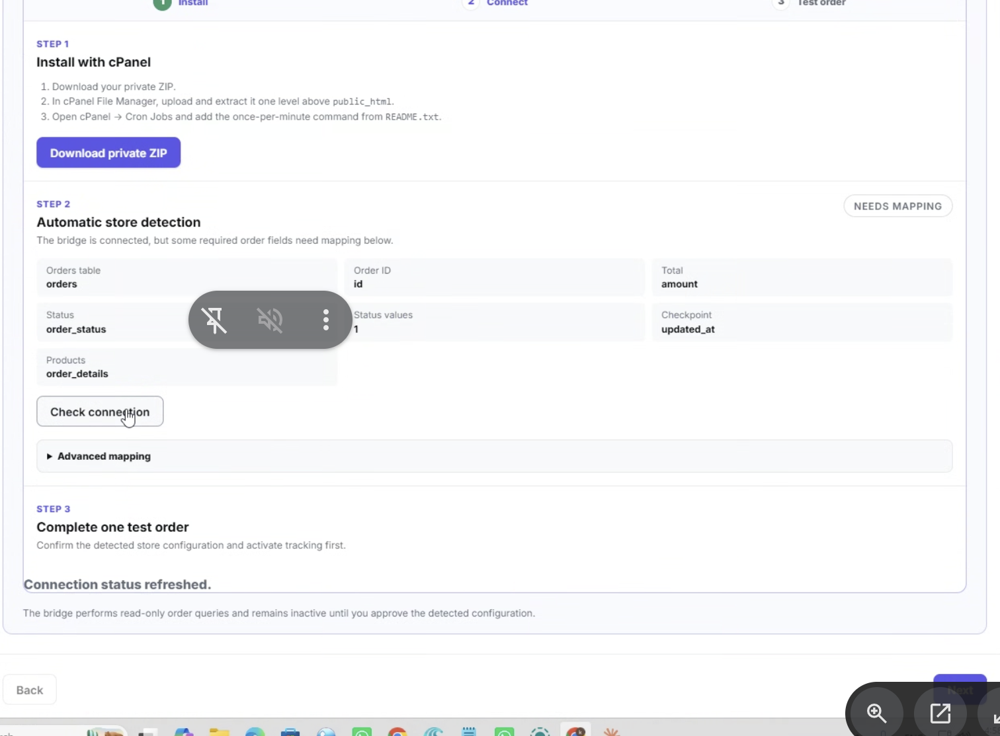
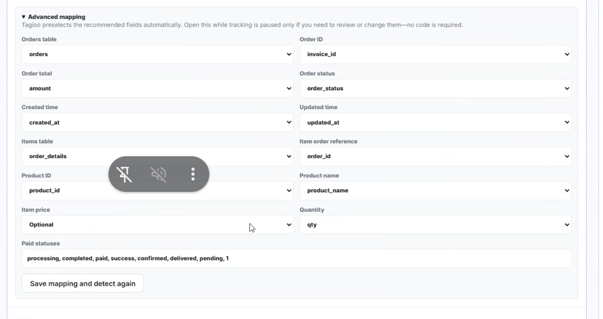
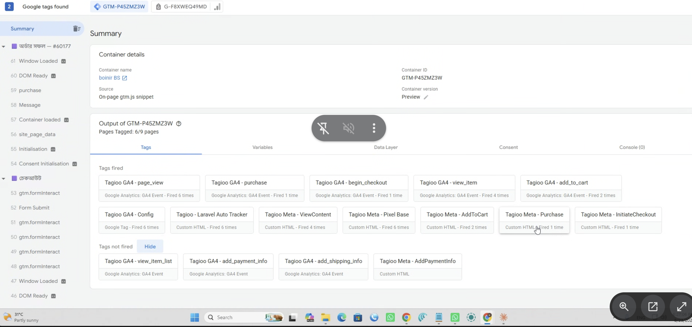
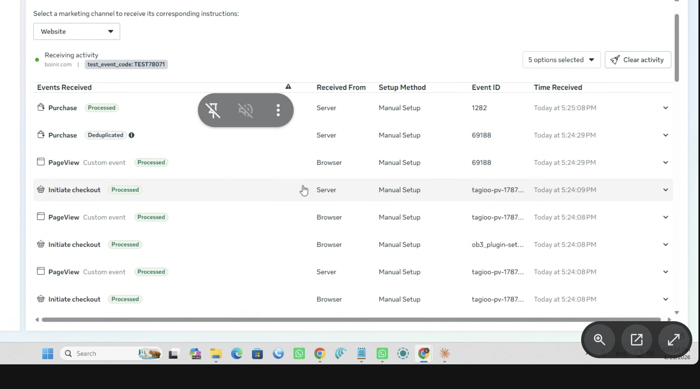
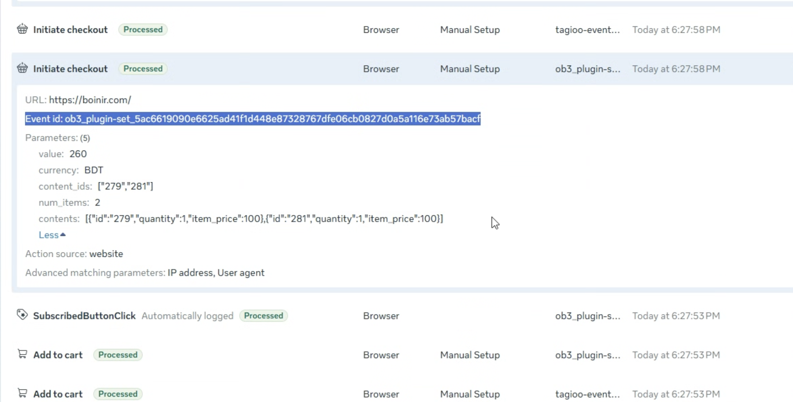

# Laravel Setup

This is the complete self-service process for connecting a Laravel ecommerce
website to Tagioo. Connect and map the private cPanel Bridge first, then generate
the Web and Server GTM files and complete one end-to-end test.

**Complete sequence:** Create containers → Create Bridge → Upload ZIP → Add Cron
→ Check connection → Map fields → Generate GTM files → Test → Publish.

The normal cPanel installation requires no Composer, terminal, Laravel code
changes, VPS access, database password, or hosting-password sharing.

## Before starting

The customer needs:

- one Web container and one Server container in Google Tag Manager;
- a Tagioo container and first-party tracking domain;
- the Laravel store URL and default currency;
- the Web GTM ID (`GTM-XXXXXXX`);
- cPanel access with **File Manager** and **Cron Jobs**;
- PHP 8.1 or newer on the cPanel Cron command line.

Add only the **Web GTM ID** to the Laravel website. The Server GTM container runs
through Tagioo and is not pasted into Laravel.

## Step 1 — Select Laravel and create the private Bridge package

1. Open **Tagioo → Setup Assistant**.
2. Select **Ecommerce → Laravel / Custom Ecommerce**.
3. Enter the public store URL, including `https://`, and confirm its currency.
4. Continue to the Laravel Bridge area.
5. Click **Download private ZIP**.

The ZIP is unique to this Tagioo tenant and store. Never reuse it for another
customer, commit it to source control, or share its `config.php` or secret.

## Step 2 — Upload and extract the Bridge in cPanel

1. Open **cPanel → File Manager**.
2. Open the account home directory, one level above `public_html`.
3. Upload the private ZIP and click **Extract**.
4. Confirm the extracted folder is:

   ```text
   /home/CPANEL_USERNAME/tagioo-bridge/
   ```

5. Confirm the folder is outside `public_html`.
6. Open `tagioo-bridge/README.txt` and read its safety rules and Cron command.



The Bridge uses read-only database `SELECT` queries. It does not edit the
Laravel website, write to order tables, or run migrations.

## Step 3 — Add the once-per-minute Cron Job

1. Open **cPanel → Cron Jobs**.
2. Choose **Once Per Minute**. All five schedule fields should contain `*`.
3. Paste the complete command from `README.txt`.
4. Confirm the PHP executable, cPanel username, and Bridge path belong to this
   hosting account.
5. Click **Add New Cron Job**.

Use the diagnostic command during setup:

```text
/usr/local/bin/php /home/CPANEL_USERNAME/tagioo-bridge/bridge.php run >> /home/CPANEL_USERNAME/tagioo-bridge/cron.log 2>&1
```



The `cron.log` suffix records normal output and errors; it does not change how
the Bridge executes. Every customer must use their own cPanel home path and the
PHP 8.1+ CLI path supplied by their host.

After the setup is fully verified, replace the logging suffix with the
production command so the log does not grow forever:

```text
/usr/local/bin/php /home/CPANEL_USERNAME/tagioo-bridge/bridge.php run > /dev/null 2>&1
```

If cPanel does not provide Cron Jobs, ask the hosting company to schedule the
supplied command once per minute. Root or VPS access is not required.

## Step 4 — Return to Tagioo and check the connection

1. Wait one or two minutes for the first Cron run.
2. Return to the Laravel Bridge area in Setup Assistant.
3. Click **Check connection**.
4. If Tagioo still shows **Not connected**, wait for one more Cron run and open
   `tagioo-bridge/cron.log` in File Manager.



### Does the customer need to enter `laravel_root`?

Normally, no. Leave this value blank:

```php
'laravel_root' => '',
```

The Bridge automatically selects the application when it finds exactly one
valid Laravel installation. Set `laravel_root` only when `cron.log` reports:

```text
More than one Laravel app was found. Set laravel_root in config.php.
```

or:

```text
Laravel was not found. Set laravel_root in config.php to the folder containing artisan.
```

In that uncommon case, use cPanel Domains or File Manager to find the Laravel
folder serving the store domain. The correct folder contains `artisan`,
`vendor/autoload.php`, and `bootstrap/app.php`.

## Step 5 — Review Advanced mapping before activation

A **Needs mapping** status means the Bridge has connected successfully but one
or more database fields need confirmation.



1. Open **Advanced mapping**.
2. Confirm the orders table, order total, status, created time, updated time,
   items table, item reference, product ID/name, price, and quantity.
3. For **Order ID**, choose the customer-facing invoice or order number, such as
   `invoice_id`, `invoice_number`, `invoice_no`, `order_number`, or `order_no`.
4. Do not select the internal database `id` when the customer sees a different
   invoice number on the confirmation page or order dashboard.
5. For COD stores, add every database status that represents a valid placed
   order. This may include `pending` or a numeric value such as `1`.
6. Click **Save mapping and detect again**.
7. Wait for the next Cron run and confirm the mapping is ready.



Tagioo receives table and column names during detection. It does not ask the
customer for a database password or transmit raw historical customer records.

## Step 6 — Activate backend Purchase tracking

When the mapping is correct, click **Activate tracking**. The first active run
checkpoints the existing orders so they are not imported as new purchases.

Create the test order only after activation.

## Step 7 — Select destinations and generate the GTM files

1. Continue through Setup Assistant to **Select destinations**.
2. Select only the platforms the customer uses.
3. GA4 and Meta are the initial defaults. Google Ads and TikTok remain excluded
   unless the customer selects them.
4. Enter the IDs, tokens, conversion labels, or test codes required by the
   selected destinations.
5. Generate and download:

   - `tagioo-web-template.json`
   - `tagioo-server-template.json`

## Step 8 — Import the Web and Server GTM files

1. In Web GTM, open **Admin → Import Container** and upload the Web JSON file.
2. In Server GTM, open **Admin → Import Container** and upload the Server JSON
   file.
3. For a clean first import, choose **Merge**.
4. When updating an existing Tagioo template, choose
   **Merge → Overwrite conflicting tags, triggers, and variables**.
5. Check the import summary and confirm only one current Tagioo tag set remains.
6. Do not publish yet. Start Preview mode for both containers.

## Step 9 — Test the storefront events in Web GTM Preview

1. Connect GTM Preview to the Laravel website.
2. Open one normal page.
3. Open one product.
4. Add the product to the cart.
5. Continue to checkout.
6. Complete one new order.
7. Confirm the Tagioo PageView, ViewContent, AddToCart, InitiateCheckout, and
   Purchase tags fire on the appropriate actions.



One customer action should not create several independent browser copies. If it
does, check the duplicate-tracking section below before publishing.

## Step 10 — Verify the backend test order in Tagioo

1. Make sure the new order reaches a status included in Advanced mapping.
2. Wait up to two minutes for the Cron Job.
3. Return to Tagioo and click **Verify test order**.
4. Confirm the public invoice/order number, value, currency, items, and selected
   destinations.

If Tagioo cannot find the order, confirm tracking was activated before the order
was created and check the newest lines in `cron.log`.

## Step 11 — Verify Meta browser/server deduplication

1. Open **Meta Events Manager → Test events**.
2. Select **Website**.
3. Enter the same test event code configured in Tagioo.
4. Clear earlier activity and perform one new test journey.
5. Compare the event name, **Received From**, and Event ID.



Seeing both **Browser** and **Server** is expected. They represent one logical
event only when the event names and Event IDs match exactly. Meta should normally
mark one of the matching copies as **Deduplicated**.

For Purchase, the Event ID should match the public invoice/order number selected
in Advanced mapping.

## Step 12 — Publish and switch the Cron to production output

1. Publish Web GTM and Server GTM only after Tagioo, GTM Preview, and the selected
   destinations pass.
2. Edit the Cron command and replace the temporary `cron.log` suffix with:

   ```text
   > /dev/null 2>&1
   ```

3. Leave the once-per-minute Cron Job enabled.

## Duplicate events from existing website tracking

Keep the Laravel website's standard ecommerce `dataLayer` pushes. Disable older
GTM tags or hard-coded calls that send the same events directly:

```javascript
fbq('track', ...)
fbq('trackCustom', ...)
ttq.track(...)
```

Tagioo funnel Event IDs normally begin with `tagioo-`. An Event ID beginning
with another prefix, such as `ob3_plugin-set_`, comes from another script on the
Laravel website and is not generated by Tagioo.



Two independent browser integrations use different Event IDs and cannot be
deduplicated as the same event. Disable the older sender when Tagioo owns that
destination.

Meta's automatically logged events, such as `SubscribedButtonClick`, are also
separate from Tagioo. Disable automatic event tracking in Meta Events Manager if
the store does not want them.

## Pause or remove the integration

- Click **Pause tracking** in Tagioo to reject new Bridge purchases.
- Disable the Cron Job for an immediate local stop.
- If supplied by the package, rename `disabled.flag.example` to `disabled.flag`
  for another local emergency stop.
- Delete the Cron Job and `tagioo-bridge` folder to remove the Bridge.

These actions do not edit or remove the Laravel website.

## Security rules

- Keep the ZIP, `tagioo-bridge`, `config.php`, logs, and secrets outside
  `public_html`.
- Never publish the private package or secret in screenshots, tickets, source
  control, or public downloads.
- Rotate the Bridge secret and install a newly generated package if the secret
  is exposed.
- Never send a Laravel database password to Tagioo.

## Quick troubleshooting

- **Not connected:** verify the PHP path, cPanel username, Bridge folder path,
  Cron schedule, and newest `cron.log` entry.
- **More than one Laravel app:** set `laravel_root` only for this uncommon case.
- **Needs mapping:** confirm every required field and valid order status, then
  save and wait for the next Cron run.
- **No test order:** confirm activation happened before the order and its status
  is included in the mapping.
- **Wrong Purchase ID:** select the public invoice/order column instead of the
  internal row ID, reactivate, and create a new test order.
- **Temporary HTTP 0 or 502:** keep the Cron enabled so the Bridge can retry, and
  check the Tagioo container status.
- **Duplicate Meta/TikTok browser events:** disable the older direct pixel sender
  while preserving the standard ecommerce `dataLayer` events.
- **Browser and Server do not deduplicate:** their event names and Event IDs must
  match exactly.
